 # Тема 1. Работа с репозиториями Git

Отчет по Теме #1 выполнил(а):
- Мырадов Акмухаммет
- ИВТ-23-2

| Задание | Лаб_раб |
|---------|---------|
| Задание 1 | + |
| Задание 2 | + |
| Задание 3 | + |
| Задание 4 | + |
| Задание 5 | + |
| Задание 6 | + |
| Задание 7 | + |
| Задание 8 | + |
| Задание 9 | + |
| Задание 10 | + |
| Задание 11 | + |
| Задание 12 | + |
| Задание 13 | + |
| Задание 14 | + |
| Задание 15 | + |

знак "+" - задание выполнено; знак "-" - задание не выполнено;

## Лабораторная работа №1
### Установка Git
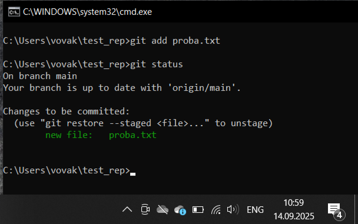

## Лабораторная работа №2  
### Настройка Git
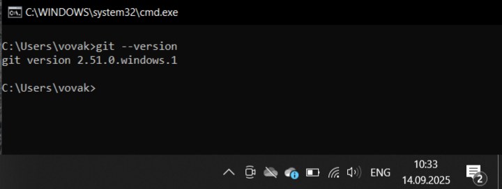

## Лабораторная работа №3
### Создание нового репозитория
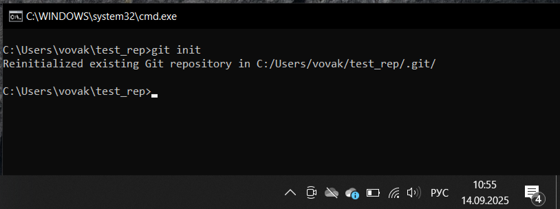

## Лабораторная работа №4
### Подготовка файлов
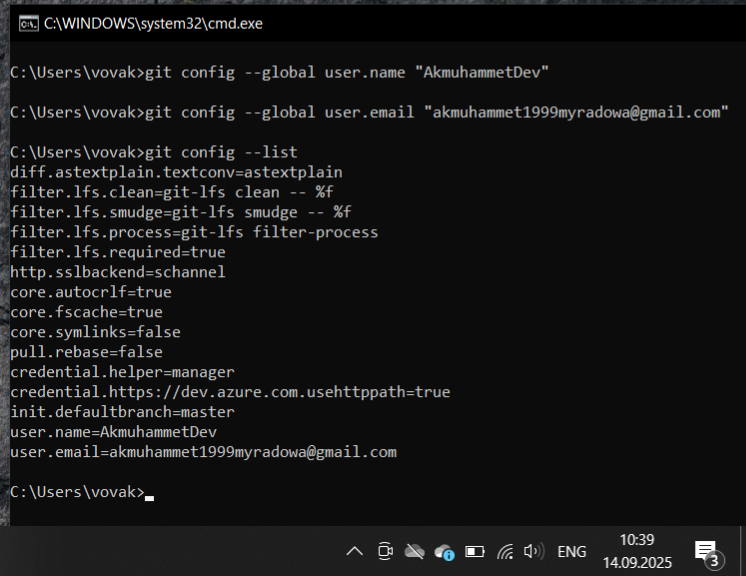

## Лабораторная работа №5
### Фиксация изменений
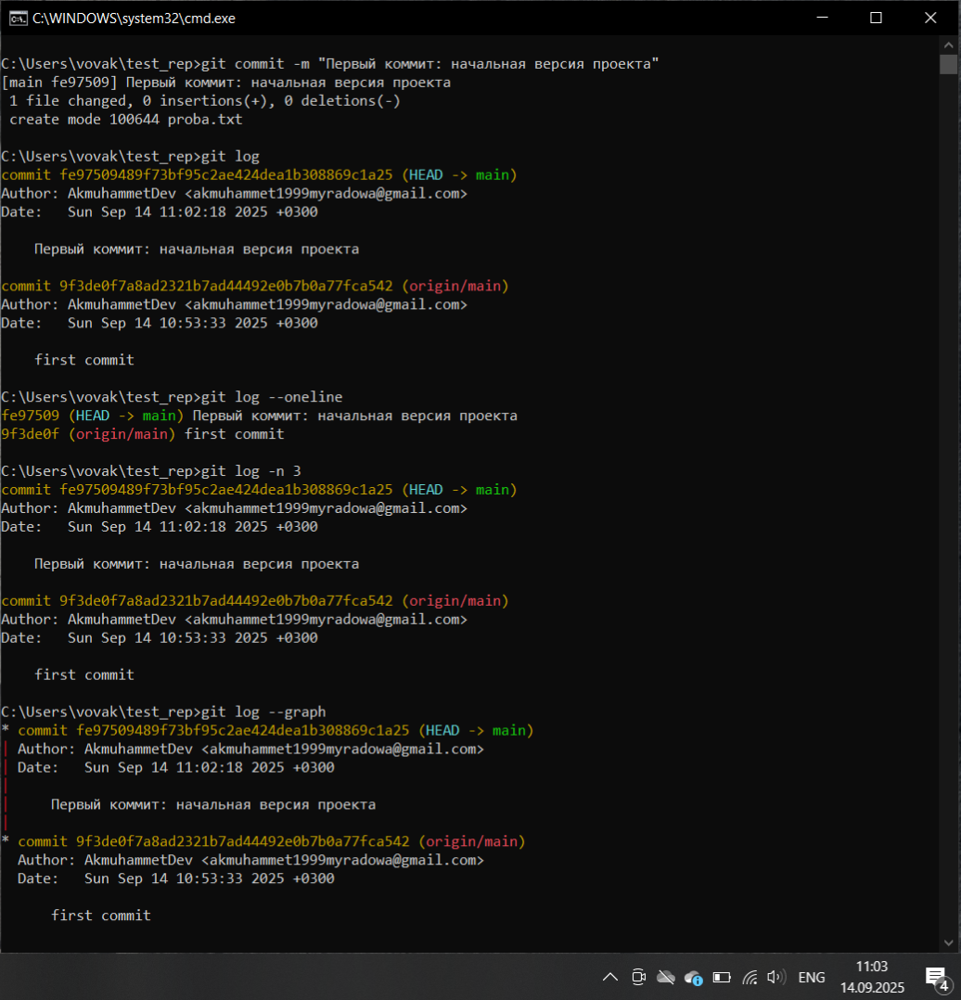

## Лабораторная работа №6
### Подключение к удаленному репозиторию
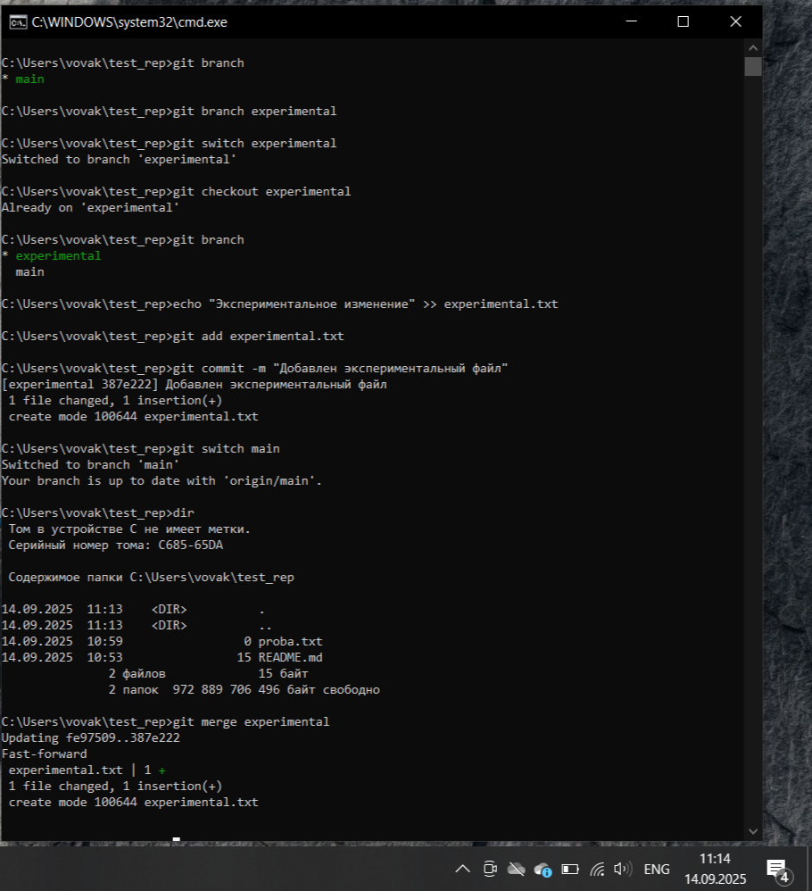

## Лабораторная работа №7
### Ветвление
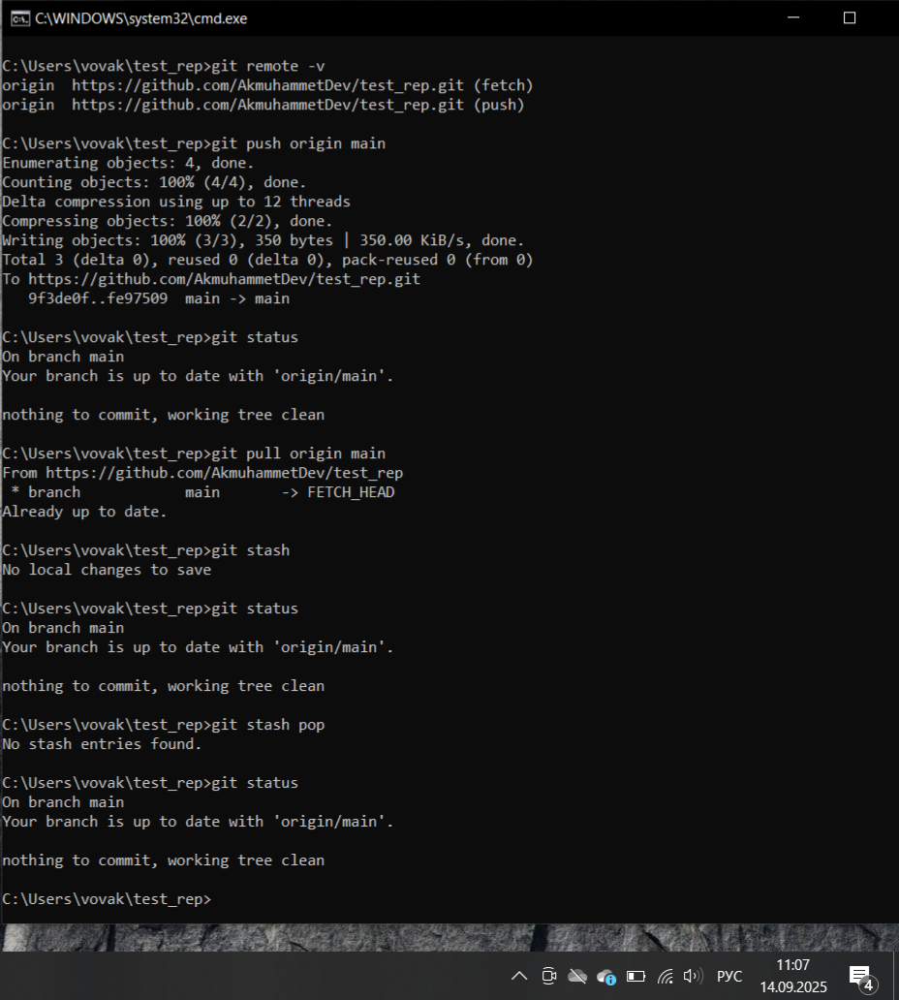

## Лабораторная работа №8
### Особенности применения "Фетч"
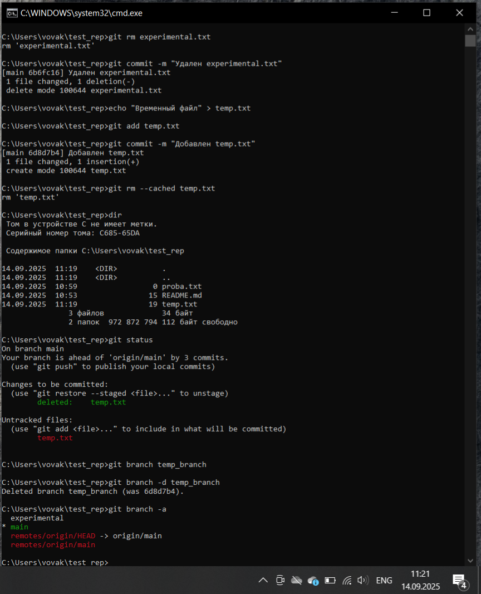

## Лабораторная работа №9
### Удаление файлов и веток
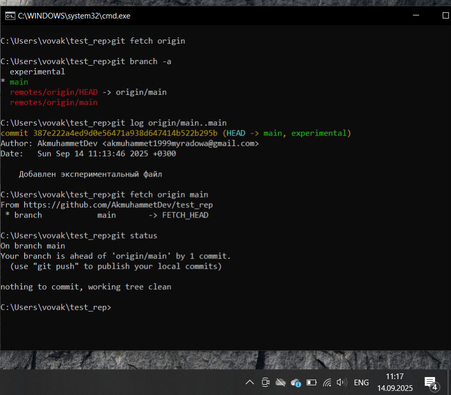

## Лабораторная работа №10
### Отслеживание изменений в коммитах
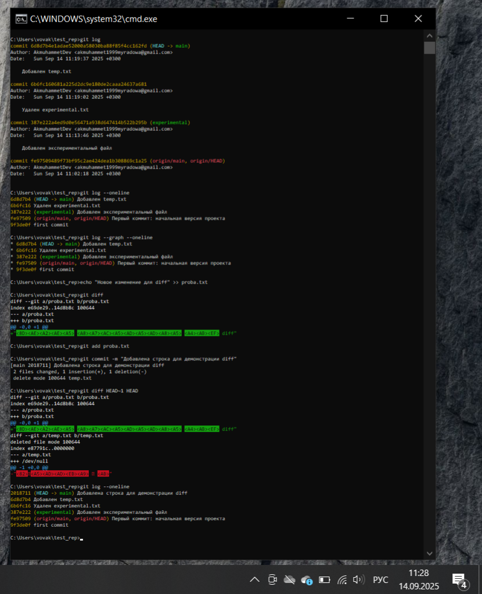

## Лабораторная работа №11
### Возвращение файла к предыдущему состоянию
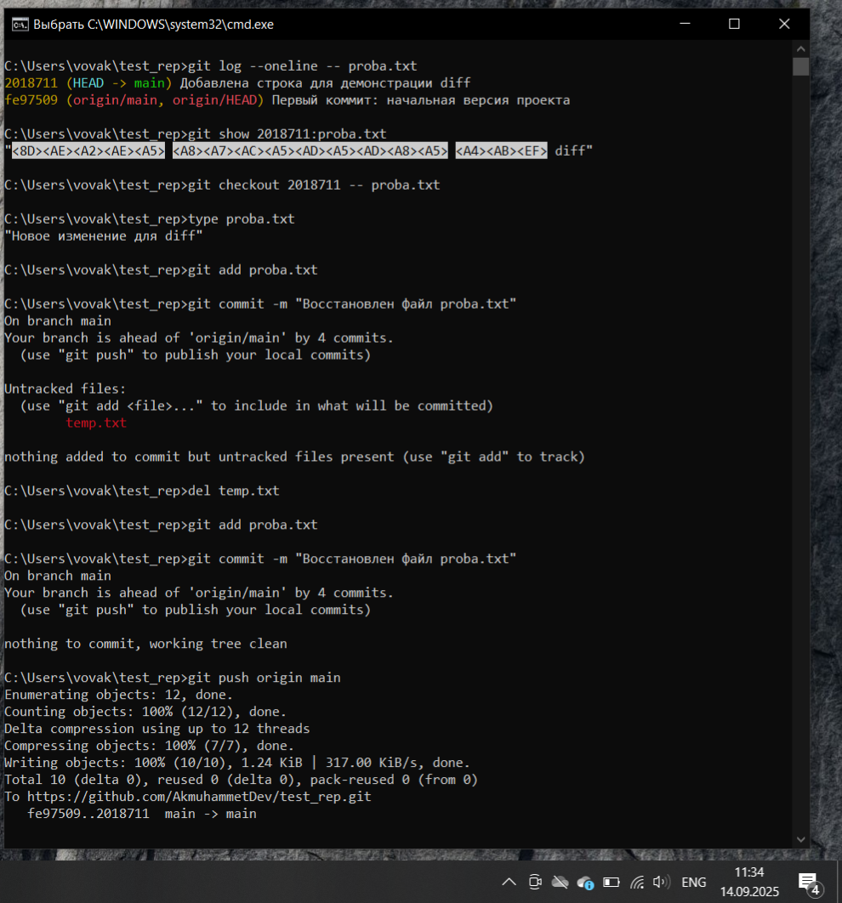

## Лабораторная работа №12
### Возвращение к предыдущему коммиту
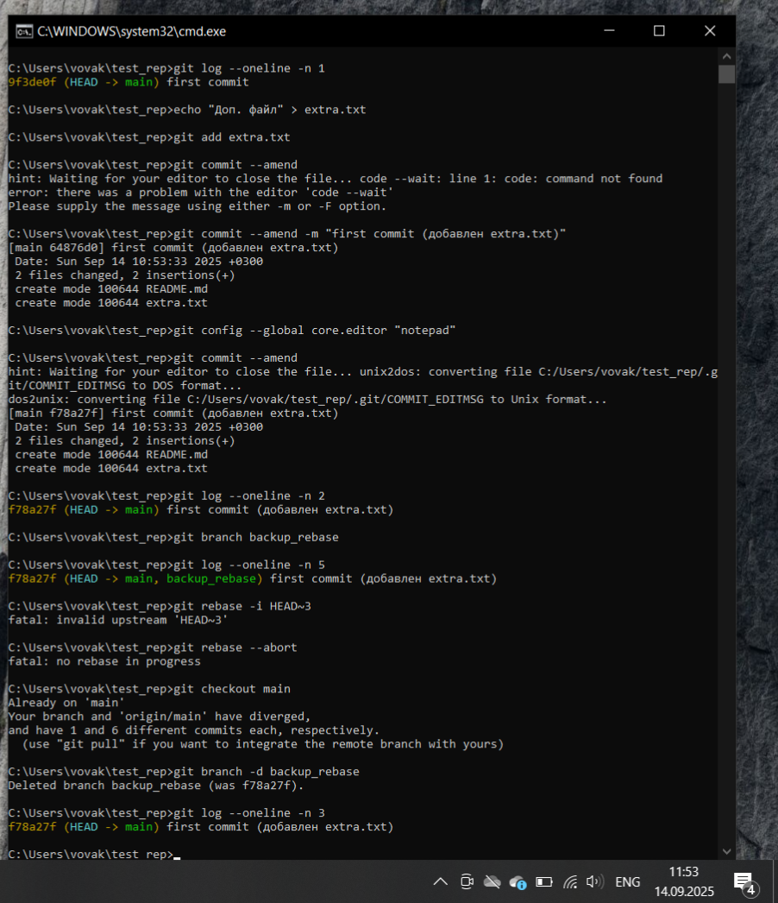

## Лабораторная работа №13
### Исправление коммита
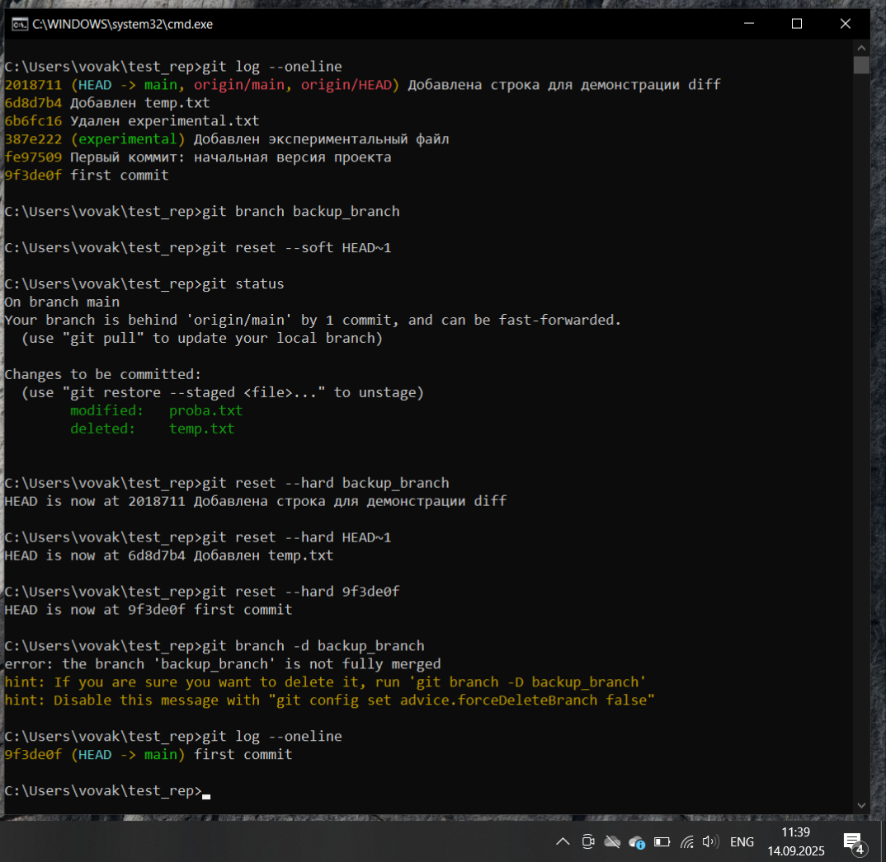

## Лабораторная работа №14
### Разрешение конфликтов при слиянии
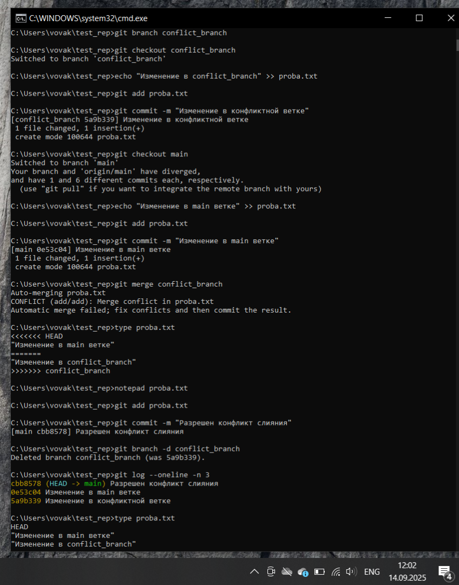

## Лабораторная работа №15
### Настройка .gitignore
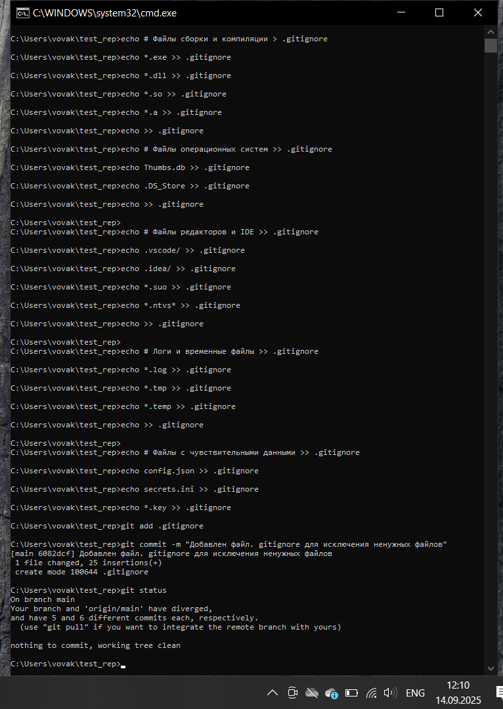

## Вывод
В ходе выполнения лабораторных работ освоил основные принципы работы с системой контроля версий Git. На практике изучил: процесс установки и настройки Git, создание и управление репозиториями, работу с ветвлением, отслеживание изменений, разрешение конфликтов слияния. Git доказал свою эффективность для управления версиями кода и организации командной работы над проектами. Особенно ценными оказались возможности отката изменений и параллельной разработки в изолированных ветках.
