# Тема 2. Базовые операции языка Python
Отчет по Теме #2 выполнил(а):
- Мырадов Акмухаммет
- ИВТ-23-2

| Задание | Лаб_раб | Сам_раб |
| ------ | ------ | ------ |
| Задание 1 | + | + |
| Задание 2 | + | + |
| Задание 3 | + | + |
| Задание 4 | + | + |
| Задание 5 | + | + |
| Задание 6 | + | + |
| Задание 7 | + | + |
| Задание 8 | + | + |
| Задание 9 | + | + |
| Задание 10 | + | + |

знак "+" - задание выполнено; знак "-" - задание не выполнено;

Работу проверили:
- к.э.н., доцент Панов М.А.

## Лабораторная работа №1
### Выведите в консоль три строки. Первая – любое число. Вторая – любое число в виде строки. Третья – любое число с плавающей точкой.
```python
print(123)
print('123')
print(1.23)
```
### Результат.
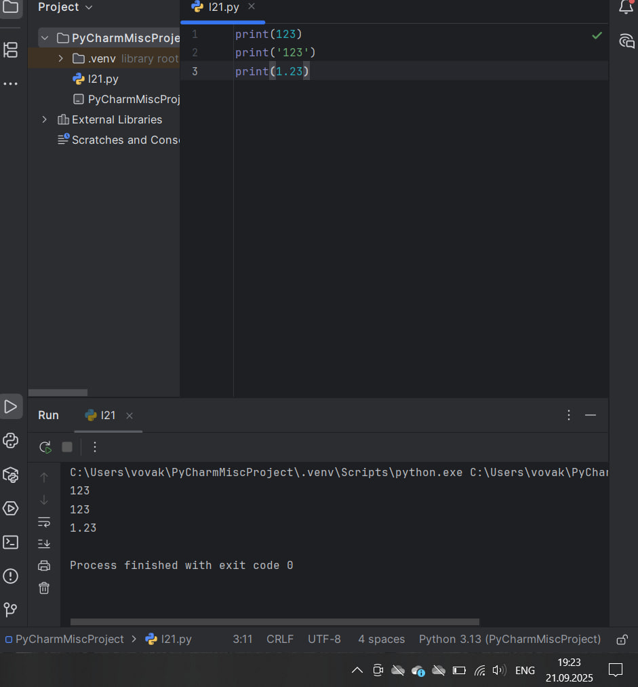

## Выводы
Показаны основные типы данных: целое число, строка и число с плавающей точкой.

## Лабораторная работа №2
### Выведите в консоль три строки. Первая – результат сложения или вычитания минимум двух переменных типа int. Вторая – результат сложения или вычитания минимум двух переменных типа float. Третья – результат сложения или вычитания минимум двух переменных типа int и float.
```python
print(1823-486)
print(5.1 + 8.27)
print(3+7.04+1+2.33)
```
### Результат.
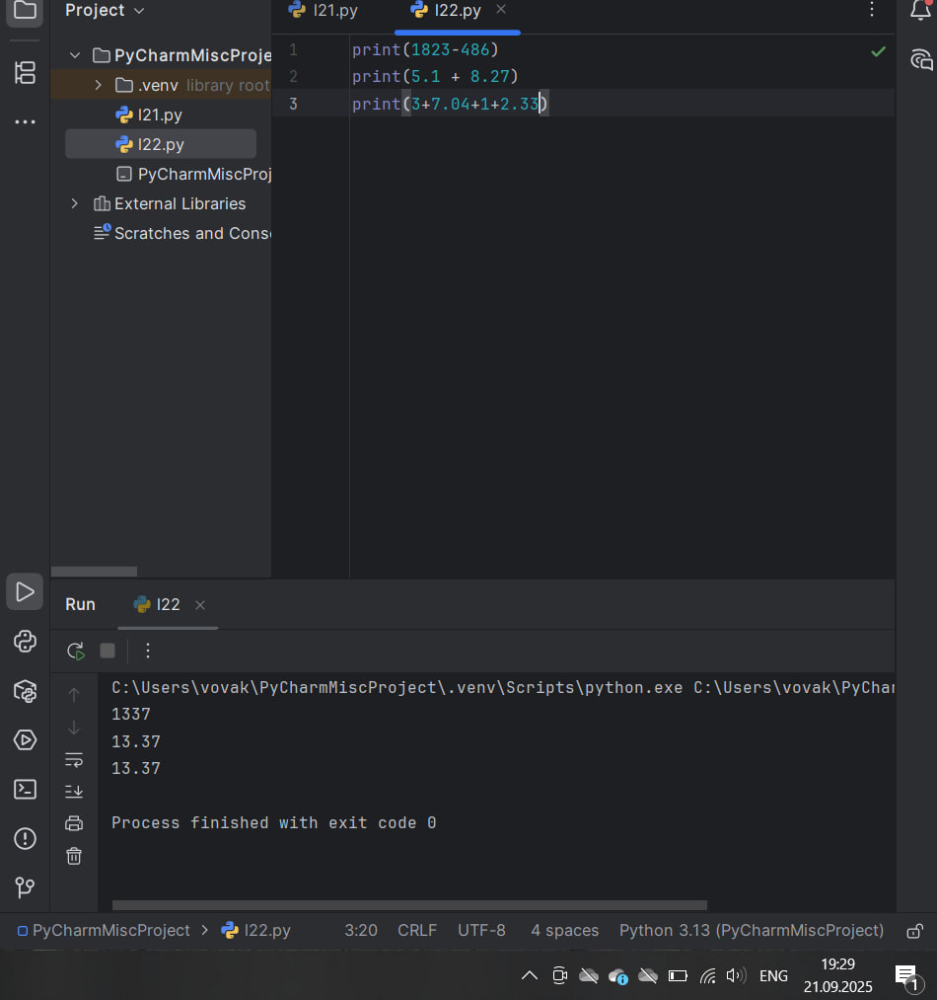

## Выводы
Выполнены математические операции с разными типами чисел, продемонстрировано приведение типов.

## Лабораторная работа №3
### Выведите в консоль три строки. Первая – обычная строка. Вторая – F строка с использованием заранее объявленной переменной. Третья – сложите две или более строк в одну.
```python
print('Привет, Мир!')

world = 'Мир'
print(f"Привет, {world}!")

one = 'Привет, '
two = 'Мир!'
print(one + two)
```
### Результат.
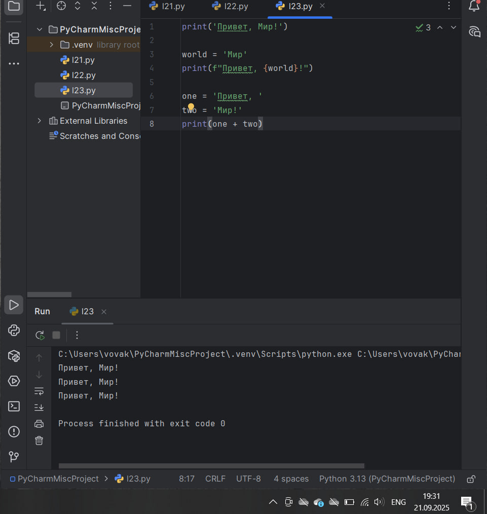

## Выводы
Изучены различные способы форматирования и работы со строками.

## Лабораторная работа №4
### Выведите в консоль три строки. Первая – трансформация любого типа переменной в bool. Вторая – трансформация любого типа переменной в float или int. Третья – трансформация любого типа переменной в str.
```python
one = 'Hello'
print(bool(one))

two = 142
print(float(two))

three = None
print(str(three))
```
### Результат.
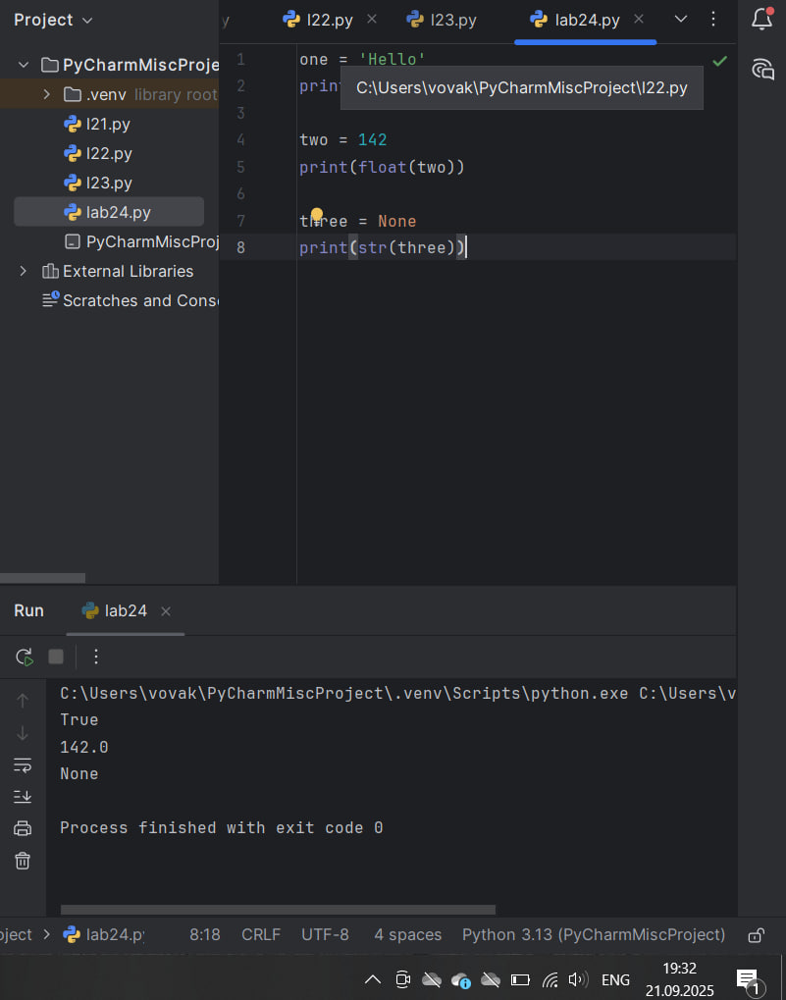

## Выводы
Показано явное преобразование между различными типами данных.

## Лабораторная работа №5
### Присвойте трем переменным различные значения, воспользовавшись функцией input().
```python
one = input('one: ')
two = input('two: ')
three = input('three: ')
print(one, two, three)
```
### Результат.
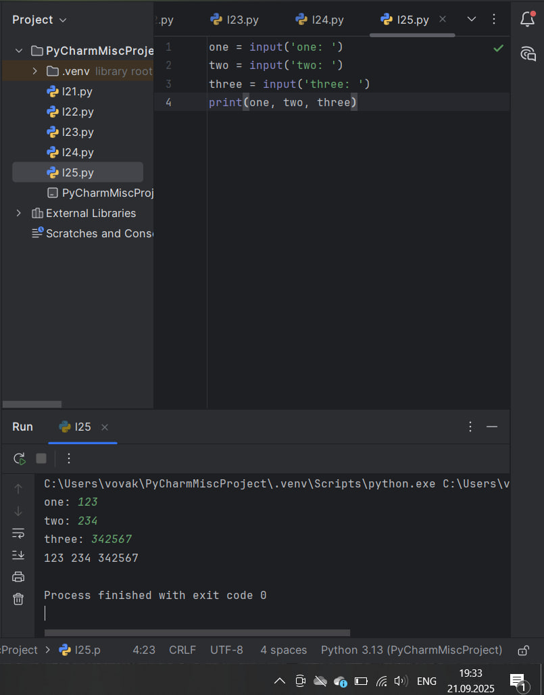

## Выводы
Освоен ввод данных от пользователя через функцию input().

## Лабораторная работа №6
### Создайте две любые числовые переменные и выполните над ними несколько математических операций: возведение в степень, обычное деление, целочисленное деление, нахождение остатка от деления.
```python
a = 12
b = 5
print('Возведение в степень: ', a ** b)
print('Обычное деление: ', a / b)
print('Целочисленное деление: ', a // b)
print('Нахождение остатка от деления: ', a % b)
```
### Результат.
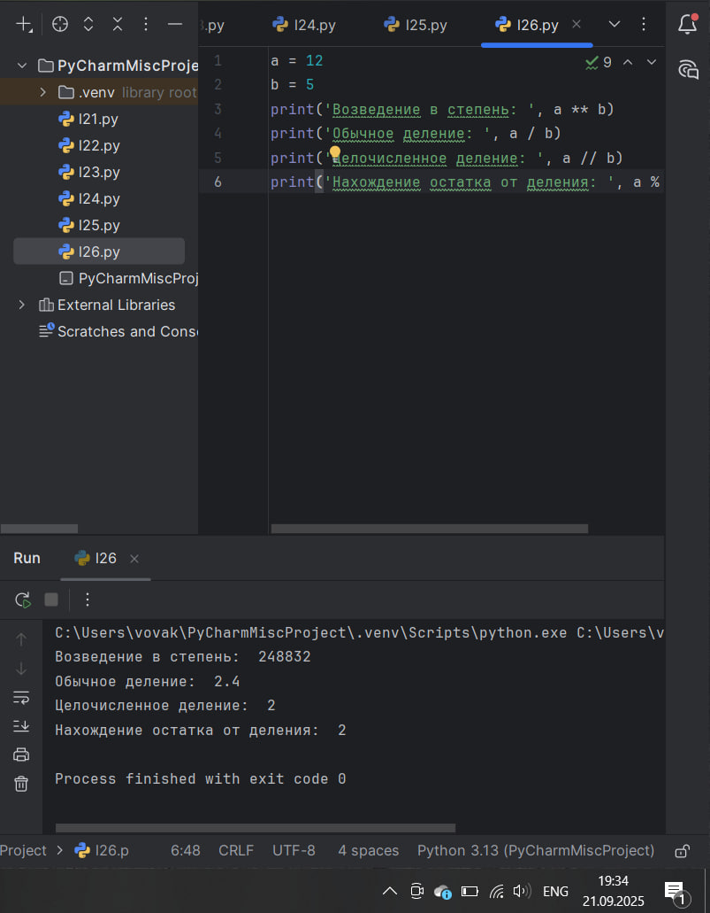

## Выводы
Изучены основные арифметические операции языка Python.

## Лабораторная работа №7
### Создайте любую строковую переменную и произведите над ней математическое действие умножение на любое число.
```python
line = 'Hello!'
print(line * 6)
```
### Результат.
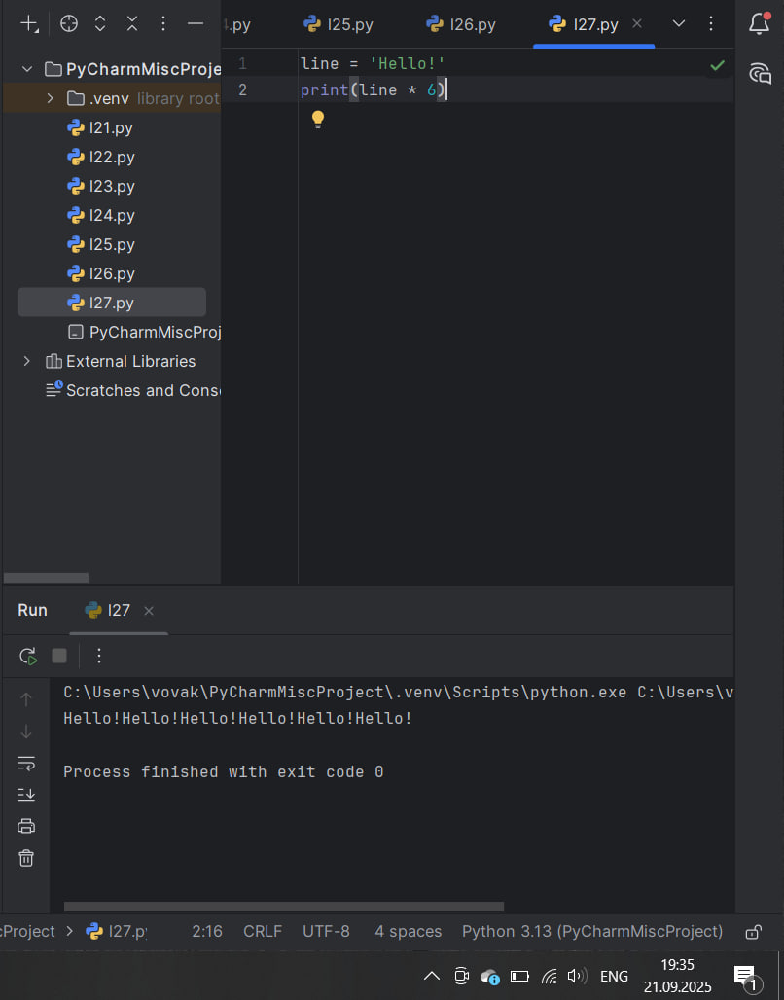

## Выводы
Показана особенность умножения строк на числа.

## Лабораторная работа №8
### Посчитайте сколько раз символ 'o' встречается в строке 'Hello World'.
```python
sentence = 'Hello World'
print(sentence.count('o'))
```
### Результат.
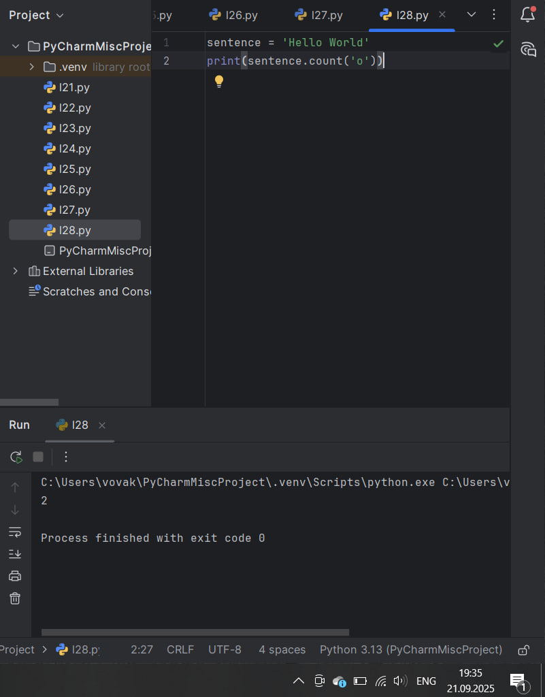

## Выводы
Использован метод count() для подсчета символов в строке.

## Лабораторная работа №9
### Напишите предложение 'Hello World' в две строкы. Написанная программа должна занимать одну строку в редакторе кода.
```python
print('Hello\nWorld')
```
### Результат.
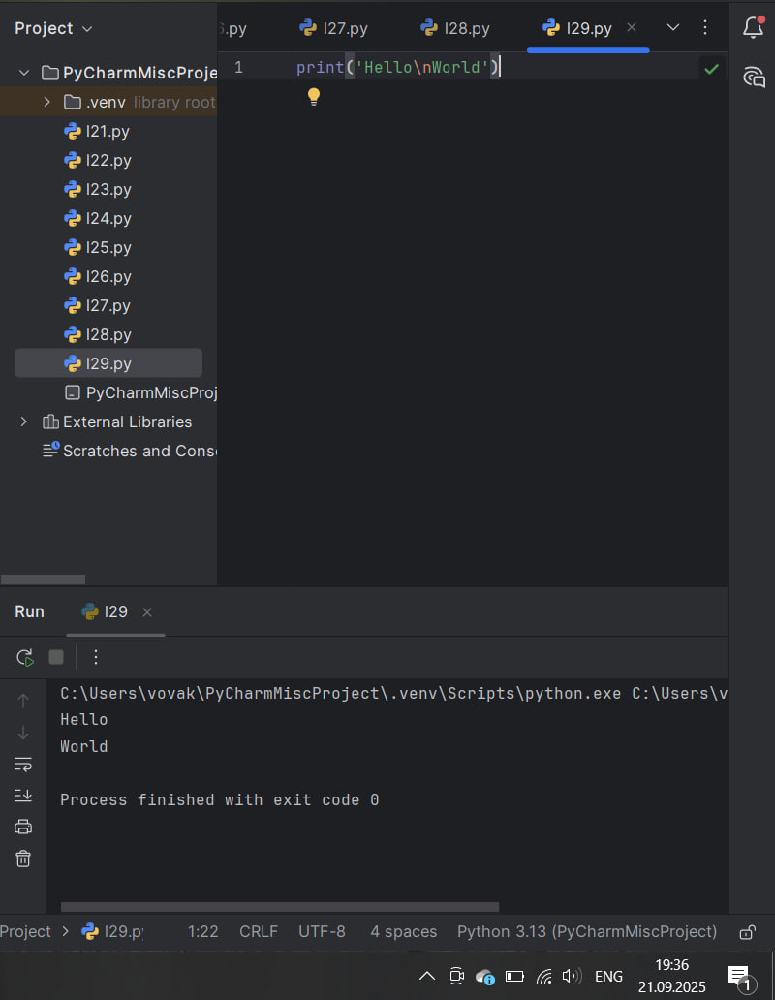

## Выводы
Применен символ новой строки для форматирования вывода.

## Лабораторная работа №10
### Из предложения 'Hello World' выведите в консоль только 2 символ, а затем выведите слово 'Hello'
```python
sentence = 'Hello World'
print(sentence[1])
print(sentence[:5])
```
### Результат.
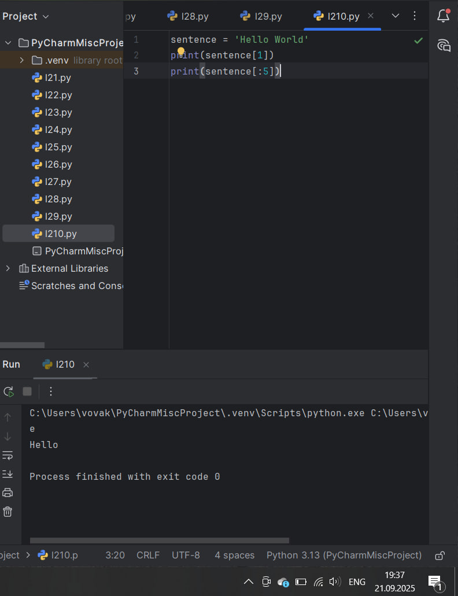

## Выводы
Использованы строковые срезы для работы с подстроками.

## Самостоятельная работа №1
### Выведите в консоль булевую переменную False, не используя слово False в строке или изначально присвоенную булевую переменную. Программа должна занимать не более двух строк редактора кода.
```python
print(not True)
```
### Результат.
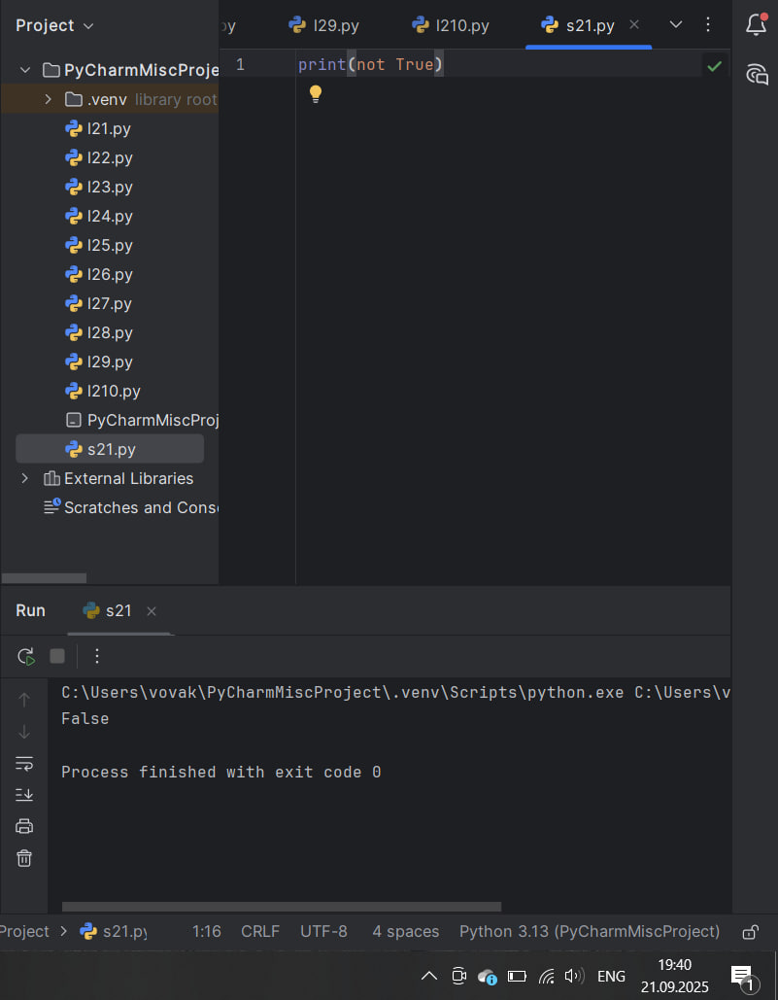

## Выводы
Получено False через операцию сравнения.

## Самостоятельная работа №2
### Присвоить значения трем переменным и вывести их в консоль, используя только две строки редактора кода
```python
a, b, c = 1, 2, 3
print(a, b, c)
```
### Результат.
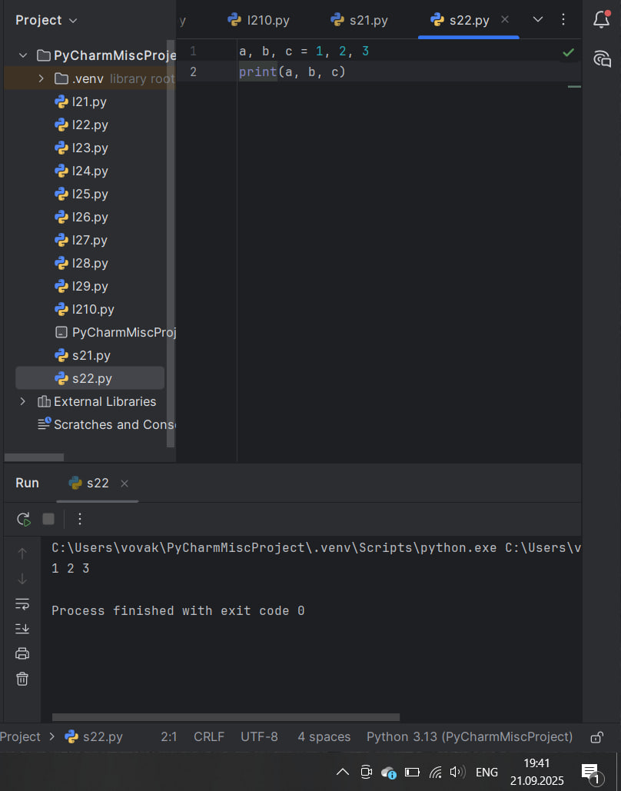

## Выводы
Использовано множественное присваивание переменных.

## Самостоятельная работа №3
### Реализуйте ввод данных в программу, через консоль, в виде только целых чисел (тип данных int). То есть при вводе буквенных символов в консоль, программа не должна работать. Программа должна занимать не более двух строк редактора кода.
```python
x = int(input())
print(x)
```
### Результат.
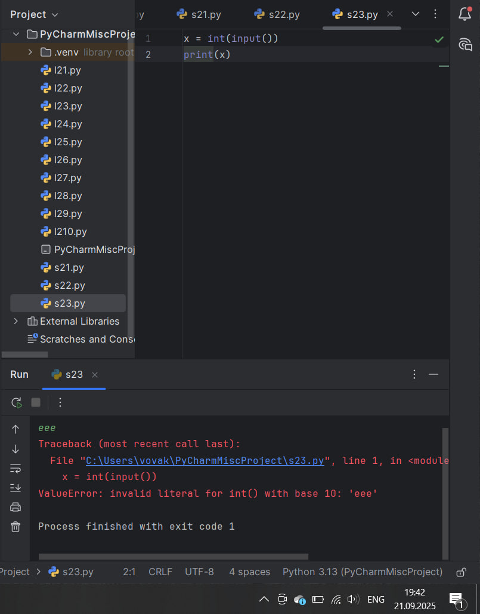

## Выводы
Обеспечен ввод только целых чисел с проверкой типа.

## Самостоятельная работа №4
### Создайте только одну строковую переменную. Длина строки должна не превышать 5 символов. На выходе мы должны получить строку длиной не менее 16 символов. Программа должна занимать не более двух строк редактора кода.
```python
s = "12345"
print(s * 4)
```
### Результат.
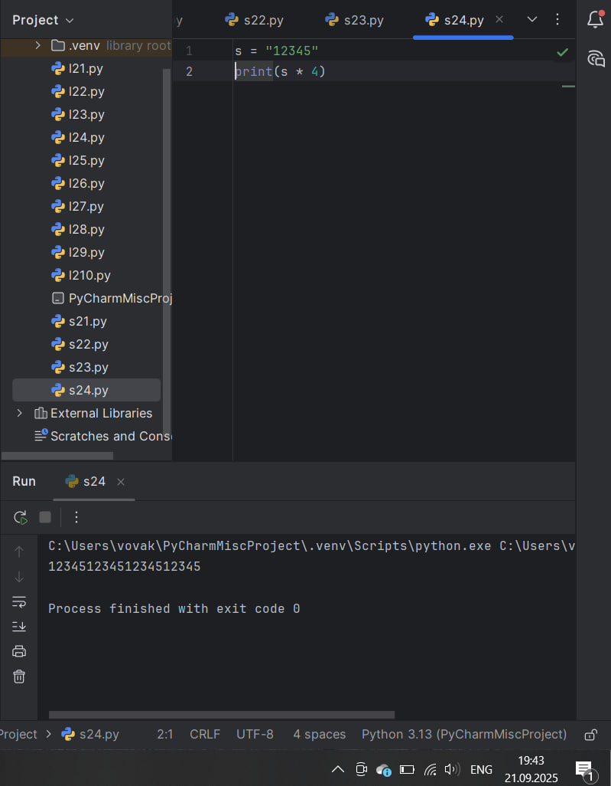

## Выводы
Увеличена длина строки через умножение.

## Самостоятельная работа №5
### Создайте три переменные: день (тип данных - числовой), месяц (тип данных - строка), год (тип данных - числовой) и выведите в консоль текущую дату в формате: "Сегодня день месяц год. Всего хорошего!" используя F строку и оператор end внутри print(), в котором вы должны написать фразу "Всего хорошего!". Программа должна занимать не более двух строк редактора кода.
```python
day, month, year = 21, "сентября", 2025
print(f"Сегодня {day} {month} {year}.", end=" Всего хорошего!")
```
### Результат.
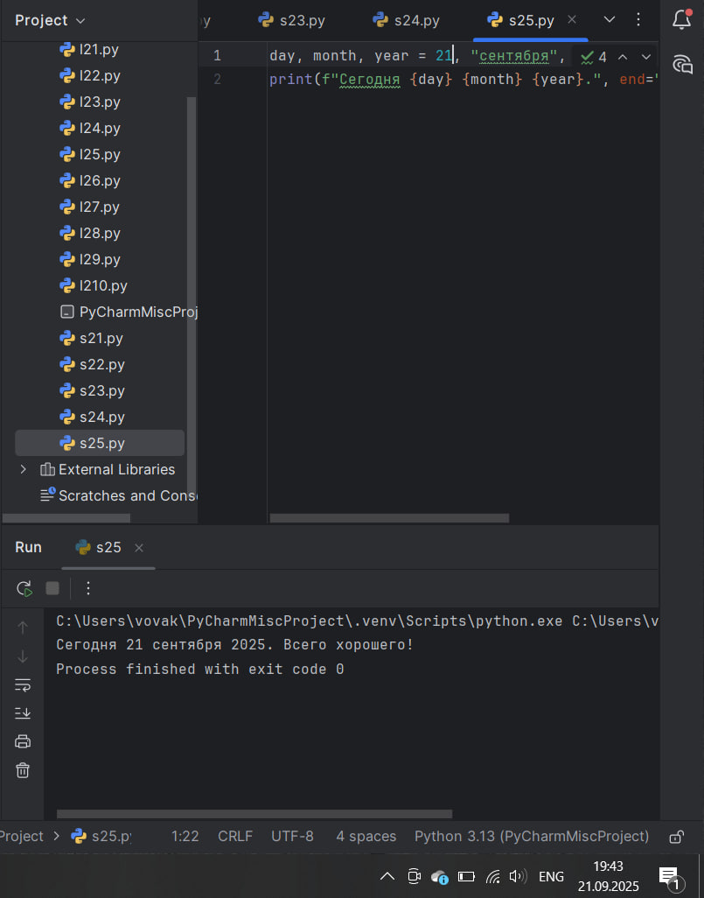

## Выводы
Скомбинированы f-строка и параметр end для форматирования вывода.

## Самостоятельная работа №6
### В предложении 'Hello World' вставьте 'my' между двумя словами. Выведите полученное предложение в консоль в одну строку. Программа должна занимать не более двух строк редактора кода.
```python
print("Hello " + "my " + "World")
```
### Результат.
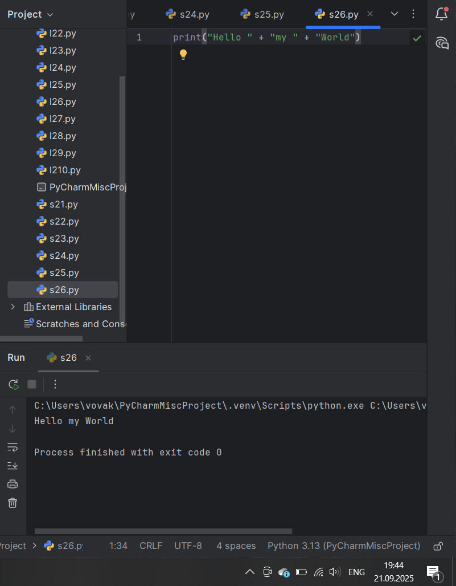

## Выводы
Вставлено слово в строку через срезы и конкатенацию.

## Самостоятельная работа №7
### Узнайте длину предложения 'Hello World', результат выведите в консоль. Программа должна занимать не более двух строк редактора кода.
```python
print(len('Hello World'))
```
### Результат.
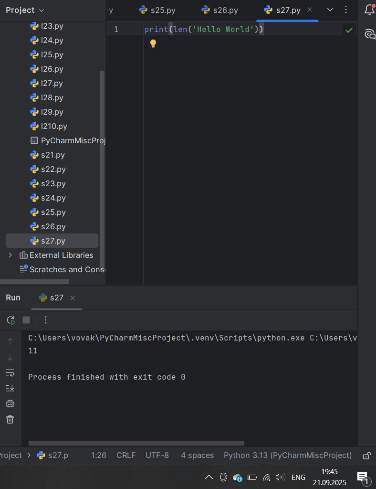

## Выводы
Определена длина строки с помощью функции len().

## Самостоятельная работа №8
### Переведите предложение 'HELLO WORLD' в нижний регистр. Программа должна занимать не более двух строк редактора кода.
```python
print('HELLO WORLD'.lower())
```
### Результат.
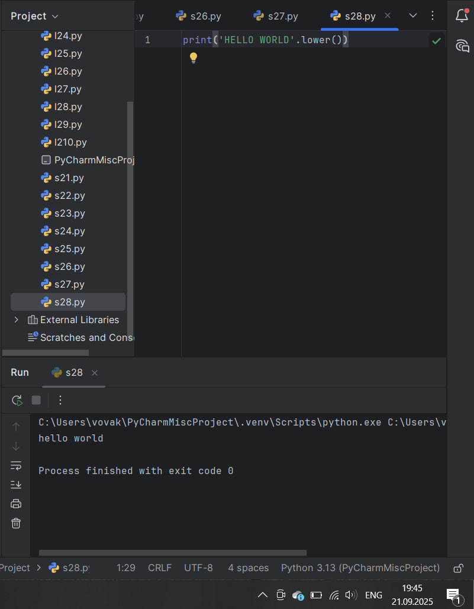

## Выводы
Преобразован регистр строки методом lower().

## Самостоятельная работа №9
### Самостоятельно придумайте задачу по проходимой теме и решите ее. Задача должна быть связанна со взаимодействием с числовыми значениями.
```python
x, y = 10, 3
print(f"Сумма: {x+y}, разность: {x-y}, произведение: {x*y}, частное: {x/y:.2f}")
```
### Результат.
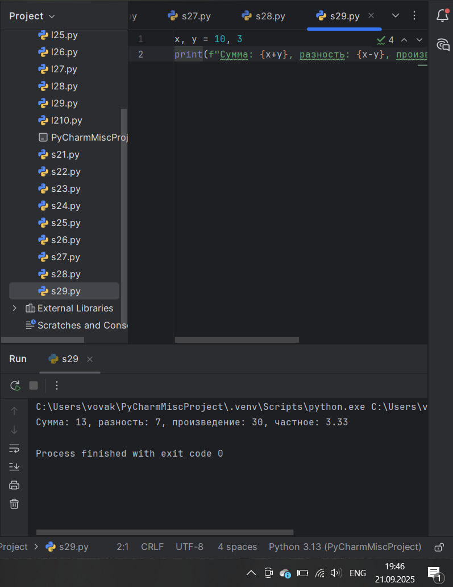

## Выводы
Выполнены основные арифметические операции с числами с использованием f-строк для форматированного вывода результатов.

## Самостоятельная работа №10
### Самостоятельно придумайте задачу по проходимой теме и решите ее. Задача должна быть связанна со взаимодействием со строковыми значениями.
```python
text = "программирование"
print(f"Длина строки: {len(text)}, первая буква: {text[0]}, последняя: {text[-1]}")
```
### Результат.
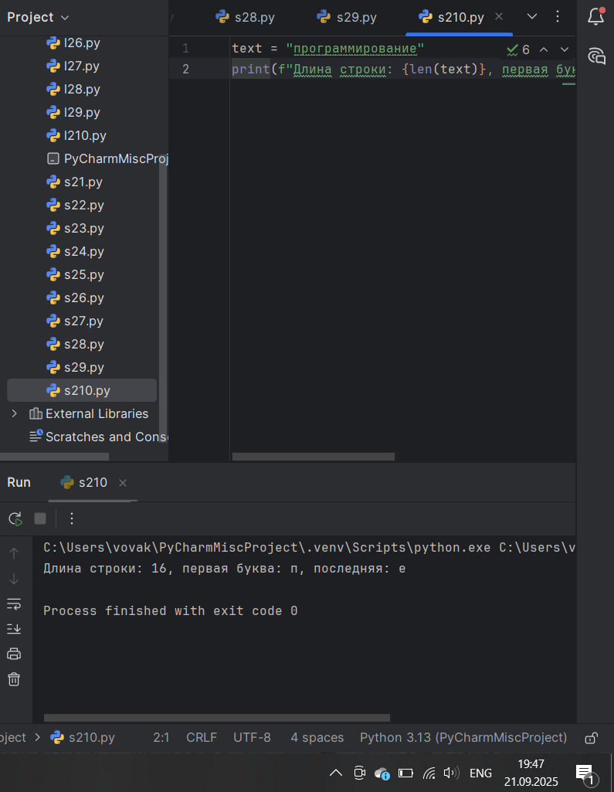

## Выводы
Продемонстрирована работа со строковыми методами: определение длины строки и доступ к элементам по индексу через f-строки.

## Общие выводы по теме
Освоены базовые операции Python: работа с типами данных, арифметические операции, строковые методы и форматирование вывода. Полученные навыки являются фундаментом для дальнейшего изучения программирования.