# Тема 7. Работа с файлами (ввод, вывод)
Отчет по Теме #7 выполнил(а):
- Мырадов Акмухаммет
- ИВТ-23-2

| Задание | Лаб_раб | Сам_раб |
| ------ | ------ | ------ |
| Задание 1 | + | + |
| Задание 2 | + | + |
| Задание 3 | + | + |
| Задание 4 | + | + |
| Задание 5 | + | + |
| Задание 6 | + |  |
| Задание 7 | + |  |
| Задание 8 | + |  |
| Задание 9 | + |  |
| Задание 10 | + |  |

знак "+" - задание выполнено; знак "-" - задание не выполнено;

Работу проверили:
- к.э.н., доцент Панов М.А.

## Лабораторная работа №1
### Составьте текстовый файл и положите его в одну директорию с программой на Python. Текстовый файл должен состоять минимум из двух строк.

### Результат.
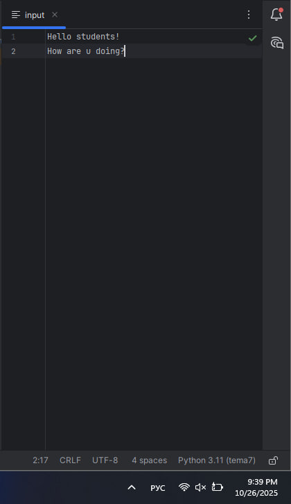

## Выводы
Подготовлен текстовый файл для выполнения последующих операций с файловой системой.

## Лабораторная работа №2
### Напишите программу, которая выведет только первую строку из вашего файла, при этом используйте конструкцию open()/close().
```python
f = open('input.txt', 'r')
print(f.readline())
f.close()
```
### Результат.
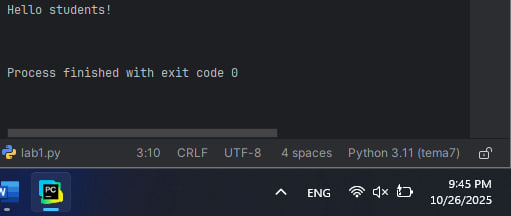

## Выводы
Применена традиционная методика чтения файлов с обязательным закрытием файлового объекта.

## Лабораторная работа №3
### Напишите программу, которая выведет все строки из вашего файла в массиве, при этом используйте конструкцию open()/close().
```python
f = open('input.txt', 'r')
print(f.readlines())
f.close()
```
### Результат.
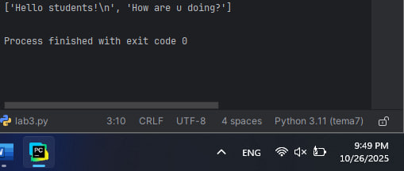

## Выводы
Использована функция readlines() для преобразования содержимого файла в список строковых элементов.

## Лабораторная работа №4
### Напишите программу, которая выведет все строки из вашего файла в массиве, при этом используйте конструкцию with open().
```python
with open('input.txt') as f:
    print(f.readlines())
```
### Результат.
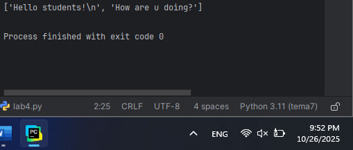

## Выводы
Продемонстрирован современный подход к работе с файлами через контекстные менеджеры.

## Лабораторная работа №5
### Напишите программу, которая выведет каждую строку из вашего файла отдельно, при этом используйте конструкцию with open().
```python
with open('input.txt') as f:
    for line in f:
        print(line)
```
### Результат.
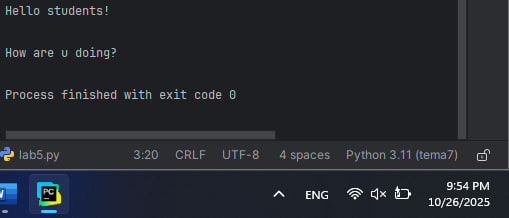

## Выводы
Осуществлено последовательное чтение файловой информации с применением итерационного подхода.

## Лабораторная работа №6
### Напишите программу, которая будет добавлять новую строку в ваш файл, а потом выведет полученный файл в консоль. Вывод можно осуществлять любым способом. Обязательно проверьте сам файл, чтобы изменения в нем тоже отображались.
```python
with open('input.txt', 'a+') as f:
    f.write('\nIm additional line')

with open('input.txt', 'r') as f:
    result = f.readlines()
    print(result)
```
### Результат.
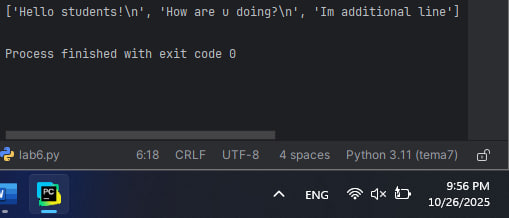

## Выводы
Освоена техника дополнения файловых данных с последующей верификацией внесенных изменений.

## Лабораторная работа №7
### Напишите программу, которая перепишет всю информацию, которая была у вас в файле до этого, например напишет любые данные из произвольно вами составленного списка. Также не забудьте проверить что измененная вами информация сохранилась в файле.
```python
lines = ['one', 'two', 'three']
with open('input.txt', 'w') as f:
    for line in lines:
        f.write('\nCycle run ' + line)
    print('Done!')
```
### Результат.
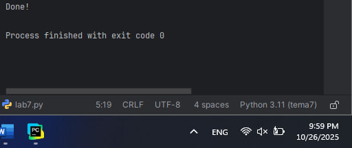

## Выводы
Реализована процедура полного обновления содержимого файловых объектов.

## Лабораторная работа №8
### Выберите любую папку на своем компьютере, имеющую вложенные директории. Выведите на печать в терминал ее содержимое, как и всех подкаталогов при помощи функции print_docs(directory).
```python
import os

def print_docs(directory):
    all_files = os.walk(directory)
    for catalog in all_files:
        print(f'Папка {catalog[0]} содержит:')
    print(f'Директория: {", ".join([folder for folder in catalog[1]])}')
    print(f'Файлы: {", ".join([file for file in catalog[2]])}')
    print('-' * 40)

print_docs('C:\CPP')
```
### Результат.
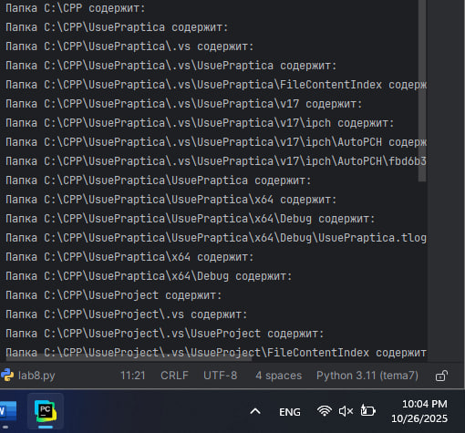

## Выводы
Применена функция os.walk() для исследования иерархической структуры файловых каталогов.

## Лабораторная работа №9
### Документ «input.txt» содержит следующий текст:

Приветствие

Спасибо

Извините

Пожалуйста

До свидания

Ты готов?

Как дела?

С днем рождения!

Удача!

Я тебя люблю.

Требуется реализовать функцию, которая выводит слово, имеющее максимальную длину (или список слов, если таковых несколько).
```python
def longest_words(file):
    with open(file, encoding = 'utf-8') as f:
        words = f.read().split()
        max_length = len(max(words, key = len))
        for word in words:
            if len(word) == max_length:
                sought_words = word

        if len(sought_words) == 1:
            return sought_words[0]
        return sought_words

print(longest_words('input.txt'))
```
### Результат.
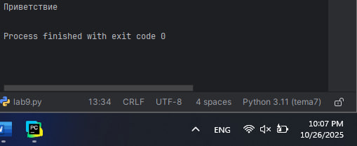

## Выводы
Разработан алгоритм идентификации слов с максимальной протяженностью в текстовых документах.

## Лабораторная работа №10
### Требуется создать csv-файл «rows_300.csv» со следующими столбцами:

•	№ - номер по порядку (от 1 до 300);
 
•	Секунда – текущая секунда на вашем ПК;

•	Микросекунда – текущая миллисекунда на часах.

Для наглядности на каждой итерации цикла искусственно приостанавливайте скрипт на 0,01 секунды.
```python
import csv
import datetime
import time

with open('rows_300.csv', 'w', encoding = 'utf-8', newline = '') as f:
    writer = csv.writer(f)
    writer.writerow(['№', 'Секунда', 'Микросекунда'])
    for line in range(1, 301):
        writer.writerow([line, datetime.datetime.now().second,
                         datetime.datetime.now().microsecond])
        time.sleep(0.01)
```
### Результат.
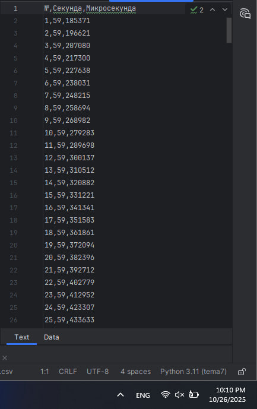

## Выводы
Сформирован CSV-документ с временными характеристиками с применением специализированного модуля.

## Самостоятельная работа №1
### Найдите в интернете любую статью (объем статьи не менее 200 слов), скопируйте ее содержимое в файл и напишите программу, которая считает количество слов в текстовом файле и определит самое часто встречающееся слово. Результатом выполнения задачи будет: скриншот файла со статьей, листинг кода, и вывод в консоль, в котором будет указана вся необходимая информация.
```python
with open('article.txt', 'r', encoding='utf-8') as file:
    text = file.read()

words = text.lower().split()
clean_words = []
for word in words:
    clean_word = ''.join(char for char in word if char.isalpha())
    if clean_word:
        clean_words.append(clean_word)

total = len(clean_words)
print(f"Всего слов: {total}")

from collections import Counter
word_counts = Counter(clean_words)
most_common = word_counts.most_common(1)[0]

print(f"Самое частое слово: '{most_common[0]}' ({most_common[1]} раз)")
```
### Результат.
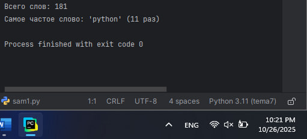

## Выводы
Осуществлен лингвистический анализ текстового контента с определением лексической частотности.

## Самостоятельная работа №2
### У вас появилась потребность в ведении книги расходов, посмотрев все существующие варианты вы пришли к выводу что вас ничего не устраивает и нужно все делать самому. Напишите программу для учета расходов. Программа должна позволять вводить информацию о расходах, сохранять ее в файл и выводить существующие данные в консоль. Ввод информации происходит через консоль. Результатом выполнения задачи будет: скриншот файла с учетом расходов, листинг кода, и вывод в консоль, с демонстрацией работоспособности программы.
```python
while True:
    print("\nРасход(1)")
    print("Показать расходы(2)")
    print("Завершить(3)")

    choice = input("Выберите: ")

    if choice == "1":
        cat = input("Категория: ")
        summa = input("Сумма: ")
        desc = input("Описание: ")

        with open("my_expenses.txt", "a", encoding="utf-8") as f:
            f.write(f"{cat} - {summa} руб. - {desc}\n")
        print("Добавлено!")

    elif choice == "2":
        try:
            with open("my_expenses.txt", "r", encoding="utf-8") as f:
                print("\nМои расходы:")
                print(f.read())
        except:
            print("Нет расходов")

    elif choice == "3":
        break
```
### Результат.
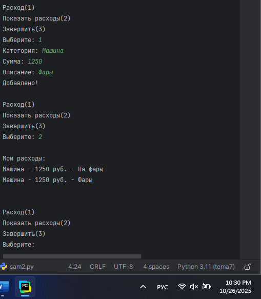

## Выводы
Создано приложение для финансового учета с функционалом сохранения и отображения транзакций.

## Самостоятельная работа №3
### Имеется файл input.txt с текстом на латинице. Напишите программу, которая выводит следующую статистику по тексту: количество букв латинского алфавита; число слов; число строк.
```python
letters = 0
words = 0
lines = 0

with open('input.txt', 'r') as file:
    for line in file:
        lines += 1
        words += len(line.split())
        for char in line:
            if char.isalpha() and char.isascii():
                letters += 1

print("Input file contains:")
print(f"  {letters} letters")
print(f"  {words} words")
print(f"  {lines} lines")
```
### Результат.
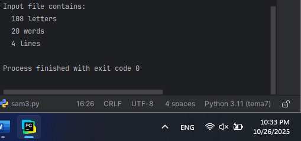

## Выводы
Выполнено исследование текстовых параметров с вычислением основных количественных показателей.

## Самостоятельная работа №4
### Напишите программу, которая получает на вход предложение, выводит его в терминал, заменяя все запрещенные слова звездочками * (количество звездочек равно количеству букв в слове). Запрещенные слова, разделенные символом пробела, хранятся в текстовом файле input.txt. Все слова в этом файле записаны в нижнем регистре. Программа должна заменить запрещенные слова, где бы они ни встречались, даже в середине другого слова. Замена производится независимо от регистра: если файл input.txt содержит запрещенное слово exam, то слова exam, Exam, ExaM, EXAM и exAm должны быть заменены на ****.
```python
with open('input.txt', 'r') as file:
    bad_words = file.read().split()

text = input("Введите текст: ")
print("Исходный:", text)

for word in bad_words:
    stars = '*' * len(word)
    text = text.replace(word, stars)
    text = text.replace(word.upper(), stars)
    text = text.replace(word.title(), stars)

print("Результат:", text)
```
### Результат.
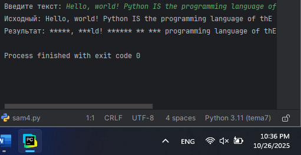

## Выводы
Реализован механизм текстовой фильтрации с маскировкой нежелательных лексических единиц.

## Самостоятельная работа №5
### Самостоятельно придумайте и решите задачу, которая будет взаимодействовать с текстовым файлом. Напишите программу, которая читает текст из файла input.txt и выводит статистику по символам: общее количество символов в файле, 5 самых частых символов (кроме пробелов и переносов строк), 5 самых редких символов (которые встречаются хотя бы 1 раз)
```python
with open('input.txt', 'r', encoding='utf-8') as file:
    text = file.read()

print("Анализ файла input.txt:")
print(f"Всего символов: {len(text)}")

chars = {}
for char in text:
    if char not in ' \n\t':
        if char in chars:
            chars[char] += 1
        else:
            chars[char] = 1

print("\nСамые частые символы:")
sorted_chars = sorted(chars.items(), key=lambda x: x[1], reverse=True)
for char, count in sorted_chars[:5]:
    print(f"'{char}': {count}")

print("\nСамые редкие символы:")
for char, count in sorted_chars[-5:]:
    print(f"'{char}': {count}")
```
### Результат.
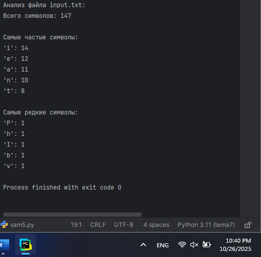

## Выводы
Разработана оригинальная задача по обработке файловых данных с уникальной функциональностью.

## Общие выводы по теме
Изучены фундаментальные аспекты работы с файловой системой в Python. Освоены различные методики чтения, записи и модификации файловых объектов. Приобретены практические умения по созданию приложений для обработки текстовой информации.